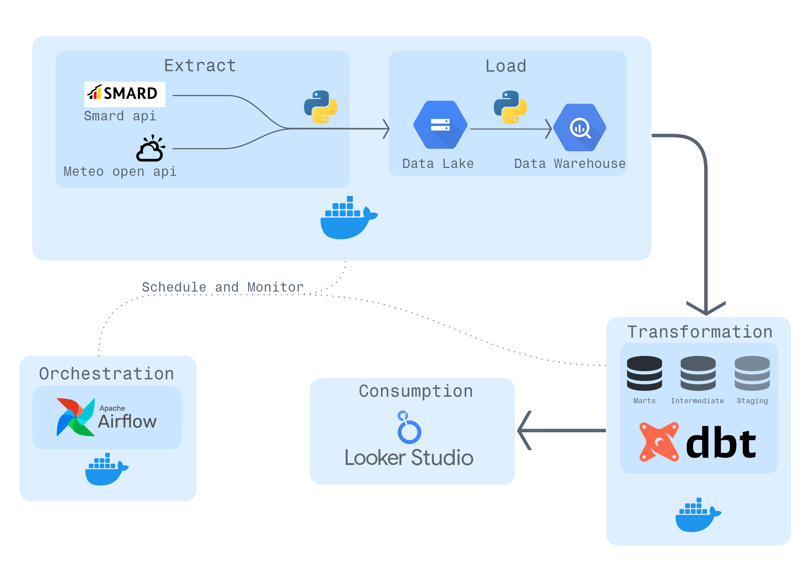

# European Energy Grid Predictor: End-to-End ML Data Pipeline
## Overview
In European energy markets, predicting the Day-Ahead price is critical for trading desks. This project is an automated, end-to-end cloud data pipeline that ingests historical day-behind (T-1) actuals to analyze market volatility. By mapping meteorological weather data directly to grid generation and market pricing, this platform allows energy traders to backtest forecasting models, visualize the Merit-Order Effect, and track cross-border price contagion during high-stress events (e.g., Dunkelflaute or negative-price wind surges).

## Prerequisites

Before you begin, ensure you have the following installed:
 * [Git](https://git-scm.com/downloads) (to clone the code)
 * [Docker](https://docs.docker.com/get-docker/) (to build and run the app)
 * A [Docker Hub](https://hub.docker.com/) account
 * install the [gcloud CLI](https://cloud.google.com/sdk/docs/install)
 * GCP Setup
   * Create a Service Account in the [GCP Console](https://console.cloud.google.com/iam-admin/serviceaccounts)
   * Grant it the Storage Object Viewer (if pulling images) or Artifact Registry Reader role.
   * Click Keys > Add Key > Create New Key (JSON).
   * Save this file as credentials.json. Do not commit this file to GitHub!
## Architecture & Tech Stack
This project utilizes a modern ELT (Extract, Load, Transform) architecture orchestrated via Docker and Apache Airflow.

 * ### Extraction (Python):

   * **Pipeline A**: Polls live energy grid data (actual generation, consumption, market prices) via the SMARD API.

   * **Pipeline B**: Polls historical weather actuals (wind speed, direction, radiation, temperature) across 6 geographic regions via the Open-Meteo API.

 * ### Data Lake (GCS):
   * Raw data is converted to Parquet format and loaded into Google Cloud Storage buckets.

 * ### Data Warehouse (BigQuery):
   * Parquet files are ingested into BigQuery for highly scalable analytics.

 * ### Transformation & Modeling (dbt): 
   * Containerized dbt models clean the data, merge time-series timestamps into a centralized intermediate table, and fan out into highly optimized business-logic data marts.

 * ### Machine Learning (BigQuery ML):

   * **Linear Regression**: Maps geographic solar radiation to solar generation limits.

   * **Boosted Trees**: Translates 18 non-linear weather dimensions into distinct Onshore and Offshore wind generation predictions (solving Wake Effect and Capacity Drift).

 * ### Orchestration (Airflow & Docker):
   * The entire Python extraction and dbt transformation pipeline is containerized and runs on a virtual machine (VM) triggered by Airflow DAGs.

 * ### Visualization:
   * Looker Studio.

<p align="center">
  
</p>


## The Data Product (Dashboard Architecture)
The BI layer is designed top-down for executive trading desks, answering "What happened?" before drilling down into the meteorological "Why?".

 * ### Level 1: The Executive Summary

   * **Focus**: Immediate T-1 KPIs.

   * **Features**: Highlights Average Wholesale Price (color-coded for negative/extreme spikes), Peak Residual Load, and Renewable Penetration Share to give traders a 5-second snapshot of grid stress.
<p align="center">
  
</p>

 * ### Level 2: The Merit-Order Stack

   * **Focus**: Core generation vs. price correlation.

   * **Features**: A dual-axis time-series chart showing the generation stack (baseload + volatile renewables) mapped against the wholesale electricity price. Visually proves the exact moment renewable surges push fossil fuels off the grid and crash the price to zero.
<p align="center">
  
</p>

 * ### Level 3: The Weather Engines (ML Translation)

   * **Focus**: The physical cause of volatility.

   * **Features**: Side-by-side performance tracking of the Machine Learning models. Shows how the synthesized AI Weather Indices perfectly map to actual grid generation, proving that price volatility is entirely at the mercy of localized weather patterns.

<p align="center">
  
</p>

 * ### Level 4: European Cross-Border Contagion

   * **Focus**: International market impact.

   * **Features*: A chronological pivot heatmap of wholesale prices across 6 European bidding zones (DE-LU, NL, BE, FR, CH, AT). Visually maps how massive solar/wind booms in Germany spill over interconnectors to crash prices in neighboring countries.
  
<p align="center">
  
</p>

## How to Run this Project
### Environment Setup:

   * Clone the repository.
   ```
   git clone https://github.com/jianpengchen-1992/European-Energy-Grid-Predictor-End-to-End-ML-Data-Pipeline.git
   ```

   * Provide GCP Service Account credentials in .env for BigQuery/GCS access.
### Baclfill historical data(local):
  * Energy data:
  ```bash
  cd energy_app
  uv run python -m src.back_filling.backfilling_energy --start 2019-01-01 --end <YYYY-MM-DD>
  ```
  Note: Replace <YYYY-MM-DD> with today's date (e.g., 2026-05-07) to get all data up to the present.
    * Weather data:
  ```bash
  cd energy_app
  uv run python -m src.back_filling.backfilling_weather --start 2019-01-01 --end <YYYY-MM-DD>
  ```
  Note: Replace <YYYY-MM-DD> with today's date (e.g., 2026-05-07) to get all data up to the present.


### Spin up Airflow & Pipelines:

   * Build the Airflow image.
   ```
   cd airflow_infrastructure
   docker build -t <your-user-name>/custom-airflow:v1 .
   ```
   * create a new terminal and build the Python pipeline image:
   ```
   cd energy_app
   docker build -t <your-user-name>/pipeline_image:v1 .
   ```
   * push the image to Docker Hub:
   ```
   docker push <your-user-name>/custom-airflow:v1
   docker push <your-user-name>/custom-airflow:v1
   ```

   * Trigger the primary DAG in the Airflow UI to begin the ELT extraction from SMARD/Meteo to GCS -> BigQuery.

### Run dbt Transformations:

   * Navigate to the dbt app folder.

   * Run dbt run to build staging, intermediate, and mart tables.
   ```
   cd energy_app
   uv run --env-file .env dbt run
   ```


### Train Machine Learning Models:

   * Execute the custom dbt macros to train the Boosted Trees without breaking dbt materialization limits:

  ```
    dbt run-operation train_solar_model
  ```


  ```
    dbt run-operation train_wind_offshore_model
  ```
  ```
    dbt run-operation train_wind_onshore_model
  ```


   * Run a final dbt run to execute the ML.PREDICT fusion models.

## Future Roadmap
### Forecast Integration:
   * Expand Pipeline B to ingest 7-day forecast data to transition the dashboard from T-1 Backtesting to Live Future Trading prediction.

### Intermediate Optimization
   * Refactor the centralized intermediate timestamp table into modular incremental models to improve dbt compilation performance.
